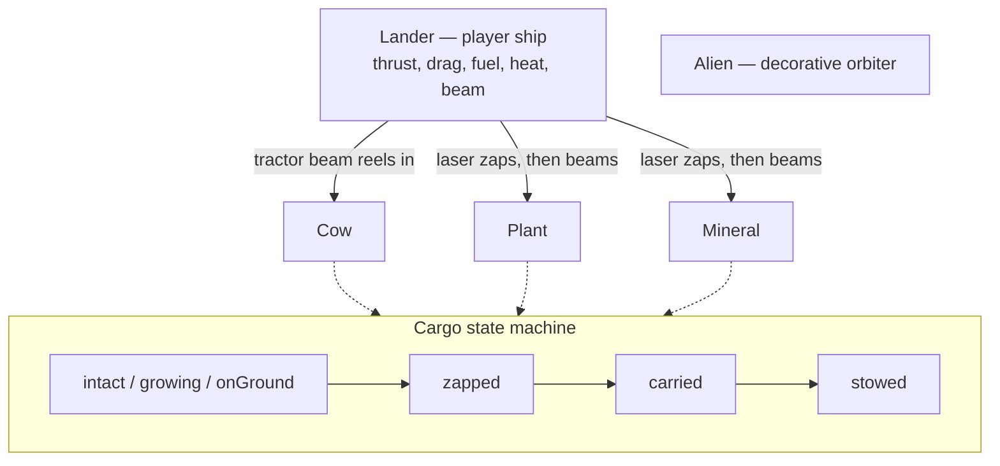

# Entities

Two kinds of objects live on top of the [world](world.md): the player's
`Lander`, and the things it harvests. The cargo entities (`Cow`, `Plant`,
`Mineral`) all share the same lifecycle so the laser and tractor beam can treat
them uniformly.

Each cargo entity exposes a `liftSpeed` tuned to its mass — plants reel in fast
(3.2), cows slowly (1.4), minerals slowest (1.8) — so heavier samples feel
heavier on the beam.

## Source

- [../src/entities/lander.js](../src/entities/lander.js) — the player ship:
  substepped physics integration, drag, fuel/cargo, hull heat, trajectory
  prediction, and the tractor beam.
- [../src/entities/cow.js](../src/entities/cow.js) — `Cow`, the headline cargo;
  kinematic capped lift toward the ship's hatch.
- [../src/entities/plant.js](../src/entities/plant.js) — `Plant`, a fractal tree
  grown from a per-plant PRNG; light and quick to reel in.
- [../src/entities/mineral.js](../src/entities/mineral.js) — `Mineral`, a lumpy
  procedural boulder mirroring the plant/cargo state machine.
- [../src/entities/alien.js](../src/entities/alien.js) — `Alien`, a cosmetic
  figure that orbits a planet's surface.

Entities are created and updated by the [game loop](game-loop.md) and positioned
relative to [Planet](world.md) surfaces.
