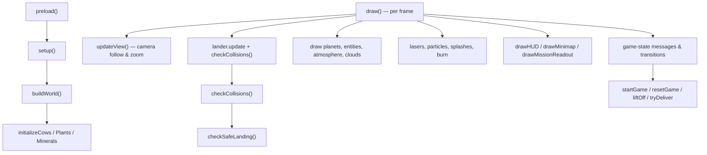

# Game loop & orchestration

[../src/sketch.js](../src/sketch.js) is the conductor. It holds the global game
state, builds the world, runs the per-frame `draw` loop, and owns every visual
system that isn't an entity or a planet. At ~2500 lines it's the largest file in
the project; the diagram below groups its functions by responsibility.

## Responsibilities

- **Lifecycle** — `preload` (assets), `setup`, `buildWorld`, `windowResized`,
  and the `draw` loop tick.
- **World seeding** — `buildWorld`, `assignPlanetNames`, `initializeCows`,
  `initializePlants`, `initializeMinerals`, `spawnCluster`, `pickDryAngle`.
- **Camera** — `view` state, `updateView`, `resetView`, `computeOverviewBox`.
- **Collision & landing** — `checkCollisions`, `checkSafeLanding`,
  `isLanderUprightForPlanet`, `getSurfaceDistance`, `getSurfaceRadius`,
  `getClosestPlanetInfo`, `distanceToLineSegment`.
- **Effects** — `fireLaser`, burn/splash/crash particle systems, and the
  `getBeamStopPositionRadial` beam geometry.
- **UI** — `drawHUD`, `drawMinimap`, `drawMissionReadout`, `drawStarField`,
  `pickConstellation`, `drawNavTargetIndicator`, `drawGameStateMessages`.
- **State machine** — `startGame`, `resetGame`, `liftOff`, `tryDeliver`,
  `updateDiscoveries`, driven by the `GAME_STATES` enum.

## Source

- [../src/sketch.js](../src/sketch.js) — the entire orchestration core: globals,
  game loop, world generation, camera, collisions, effects, HUD, and state.

It wires together the [entities](entities.md) and the [world](world.md), and
drives the thruster synth in [../src/core/sound.js](../src/core/sound.js).
