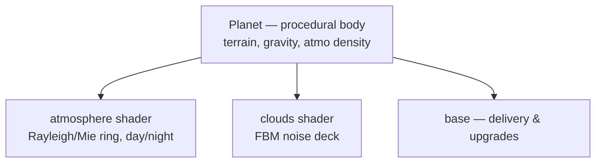

# World & rendering

The world is a set of procedurally generated `Planet` bodies orbiting a sun,
each wrapped in two fullscreen-shader layers — an `atmosphere` glow and a
`cloud` deck — plus the player's home `base`.

The shader layers run as fullscreen overlays *after* the camera transform: they
reconstruct each pixel's world position from `view` (focus, scale, rotation) so
the atmosphere ring and cloud deck stay locked to their planet as the camera
follows the ship. The arc/ring effect is explained in detail in [../doc.md](../doc.md),
and the math is sourced from the articles in [../references.md](../references.md).

## Surface art direction

The world uses a side-on orthographic style rather than a true perspective
camera. Every surface prop should be drawn in the planet's local surface frame:

- Local `x` follows the terrain tangent.
- Local `-y` points up into the sky.
- Local `+y` points down into the planet.

Ground-plane circles read as low ellipses. Keep a consistent ellipse ratio:
width at full size, height around `14-20%` of width. This implies a shallow
view angle, roughly `8-12deg` above the ground plane, and keeps pads, shadows,
craters, puddles, and buried bases speaking the same visual language.

Use this grammar for consistency:

- Round objects on the ground become ellipses, not perspective disks.
- Upright objects stand along local `-y`.
- Grounded props are sunk slightly into local `+y`.
- Shadows are flat ellipses offset into local `+y`.
- Avoid vanishing-point construction; keep edges parallel and graphic.

## Source

- [../src/world/planet.js](../src/world/planet.js) — `Planet`: noisy terrain
  generation, density-derived surface gravity (`GRAVITY_REFERENCE_RADIUS`),
  atmospheric density sampling, and the base radial atmosphere gradient.
- [../src/world/atmosphere.js](../src/world/atmosphere.js) — per-planet
  atmosphere fragment shader; the floating Gaussian glow band and sunset
  terminator.
- [../src/world/clouds.js](../src/world/clouds.js) — per-planet cloud fragment
  shader; hash-based FBM value noise with Beer's-law opacity.
- [../src/world/base.js](../src/world/base.js) — the home base: `DELIVERY_GOAL`,
  delivery range, and the `UPGRADES` table (cargo, engine, fuel, …).

Planets are generated by the [game loop](game-loop.md)'s `buildWorld` and host
the [entities](entities.md) on their surfaces.
