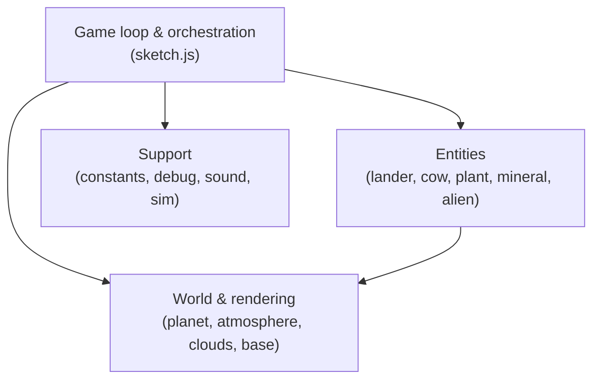

# Cow Abductor

A 2D p5.js game: pilot a lander through a solar system, descend through
planetary atmospheres, and tractor-beam cows, plants, and minerals back to your
base. Physics (gravity, drag, hull heat) and rendering (shader atmospheres,
clouds, day/night terminator) are all home-grown.

The game runs from [index.html](index.html), which loads `p5.js` and then the
source files below in dependency order. The same source also powers a headless
physics harness at [sim.html](sim.html).

## Subsystems

- **[Game loop & orchestration](architecture/game-loop.md)** — `setup`/`draw`,
  world generation, camera, HUD/minimap, laser, particles, collisions, and game
  state. The hub everything else hangs off of.
- **[Entities](architecture/entities.md)** — the player's `Lander` and the
  abductable `Cow` / `Plant` / `Mineral`, plus the decorative `Alien`.
- **[World & rendering](architecture/world.md)** — procedural `Planet` bodies,
  the shader-based `atmosphere` and `clouds` layers, and the home `base`.

## Conventions

Small cross-cutting modules used everywhere:

- [src/constants.js](src/constants.js) — the `GAME_STATES` enum (WAITING,
  PLAYING, LANDED, CRASHED, GAMEOVER) shared across the loop.
- [src/core/debug.js](src/core/debug.js) — the `DEBUG` tunables object (thrust,
  gravity, atmosphere, heat, camera) with localStorage persistence and the
  in-game debug panel.
- [src/core/sound.js](src/core/sound.js) — `RocketSound`, a WebAudio noise-band
  synth for the thruster, driven by the game loop's `updateThruster`.

## Testing & simulation

- [src/core/simulate.js](src/core/simulate.js) — a headless physics harness that
  overrides p5's `setup`/`draw` to run repeatable simulations against the real
  `Lander`/`Planet` code. Served by [sim.html](sim.html).

## Reference

- [doc.md](doc.md) — how the atmosphere arc/ring shader effect works.
- [references.md](references.md) — external articles the generative effects were
  adapted from.
